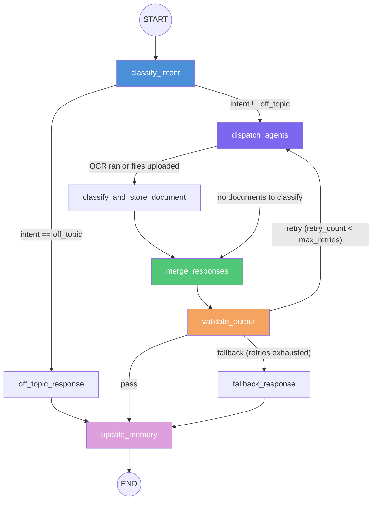

# Architecture

## Design Philosophy

Judge Assistant (Hakim) is a **multi-agent AI system** purpose-built for Egyptian civil court judges. The design is driven by several core principles:

1. **Multi-agent orchestration** -- Complex legal queries often require multiple capabilities (OCR, retrieval, reasoning, summarization). A supervisor agent classifies intent and dispatches to one or more specialist agents, then merges and validates outputs before responding.

2. **LangGraph state machines** -- Both the supervisor and the Civil Law RAG pipeline are implemented as LangGraph `StateGraph` workflows with explicit state management, conditional routing, and retry logic.

3. **SSE streaming** -- The query endpoint uses Server-Sent Events so the frontend receives real-time progress updates as each graph node executes, rather than waiting for the full pipeline to complete.

4. **Real tests against real infrastructure** -- The test suite includes integration tests against actual database connections, behavioral tests for answer consistency, and a golden dataset evaluation framework.

5. **Centralized configuration** -- A single `config/settings.yaml` file is the source of truth, with local overrides via `settings.local.yaml` and environment variable overrides using the `JA_` prefix convention.

---

## System Components

### 1. FastAPI Layer (`api/`)

The HTTP interface for all clients. Built with FastAPI, it handles:
- JWT authentication (shared secret with Express backend)
- File uploads (multipart, stored in MinIO or local disk)
- SSE streaming for query responses
- CORS middleware
- Structured error handling with machine-readable error codes
- Lifespan management for all database connections

**Entry point**: `api/app.py` -> `create_app()` factory

### 2. LangGraph Supervisor (`Supervisor/`)

The orchestration brain. An 8-node LangGraph state machine that:
- Classifies judge query intent
- Dispatches to appropriate agent(s)
- Optionally classifies and stores documents
- Merges multi-agent responses
- Validates output quality (hallucination, relevance, completeness)
- Manages conversation memory
- Handles retries and fallback

**Entry point**: `Supervisor/graph.py` -> `build_supervisor_graph()`

### 3. Agent Adapters (`Supervisor/agents/`)

Five adapter classes, each implementing `AgentAdapter` from `Supervisor/agents/base.py`:

| Adapter | Target Pipeline | Purpose |
|---|---|---|
| `OCRAdapter` | `OCR/` | Arabic text extraction from images/PDFs |
| `SummarizeAdapter` | `Summerize/` | Multi-document legal summarization |
| `CivilLawRAGAdapter` | `RAG/Civil Law RAG/` | Egyptian civil law article retrieval |
| `CaseDocRAGAdapter` | `RAG/Case Doc RAG/` | Case-specific document retrieval |
| `CaseReasonerAdapter` | `Case Reasoner/` | Legal reasoning over case facts |

### 4. Civil Law RAG Pipeline (`RAG/Civil Law RAG/`)

A standalone LangGraph workflow for retrieving and answering questions about Egyptian civil law articles. Uses Qdrant collection `judicial_docs` with `BAAI/bge-m3` embeddings (1024 dimensions).

### 5. Case Document RAG (`RAG/Case Doc RAG/`)

Retrieves information from case-specific documents stored in Qdrant collection `case_docs`. Uses MMR (Maximal Marginal Relevance) search with `k=8`.

### 6. Summarization Pipeline (`Summerize/`)

A 7-node pipeline with rich Pydantic schemas that produces structured Arabic case briefs. Nodes:
- **Node 0**: Text normalization and chunking
- **Node 1**: Semantic role classification (facts, requests, defenses, evidence, legal basis, procedures)
- **Node 2**: Atomic legal bullet extraction
- **Node 3**: Cross-party aggregation (agreed, disputed, party-specific)
- **Node 4A**: Thematic clustering
- **Node 4B**: Theme-level synthesis
- **Node 5**: Final brief generation

### 7. Case Reasoner (`Case Reasoner/`)

Applies judicial reasoning to case facts against relevant law articles.

### 8. OCR Pipeline (`OCR/`)

Arabic text extraction using Surya OCR with preprocessing (deskew, denoise, border removal, contrast enhancement), confidence scoring, and dictionary-based post-processing with a legal Arabic dictionary.

### 9. Centralized Config (`config/`)

- `config/settings.yaml` -- Single source of truth for all configuration
- `config/__init__.py` -- Loads YAML, applies local overrides, applies `JA_` env var overrides, exposes `cfg` singleton and `get_llm()` factory
- `config/api.py` -- Pydantic `Settings` class for FastAPI with defaults from `cfg`
- `config/supervisor.py` -- Supervisor constants (`MAX_RETRIES`, `AGENT_NAMES`, `VALID_INTENTS`)
- `config/rag.py` -- RAG pipeline defaults
- `config/ocr.py` -- OCR pipeline configuration

### 10. Databases

| Database | Client Module | Purpose |
|---|---|---|
| **MongoDB** (Motor async) | `api/db/mongodb.py` | Cases, conversations, summaries, files, documents |
| **Qdrant** | `api/db/qdrant.py` | Vector embeddings for civil law articles and case documents |
| **Redis** | `api/db/redis.py` | LLM response caching, rate limiting, session context |
| **MinIO** | `api/db/minio_client.py` | S3-compatible object storage for uploaded files |
| **PostgreSQL** (SQLAlchemy async) | `api/db/postgres.py` | User management, RBAC, audit logging |

### 11. Streamlit Testing UI (`streamlit_app/`)

A multi-page Streamlit application for manual testing of all API endpoints. Activated with the `testing` Docker Compose profile.

---

## Supervisor Graph Flow



### Router Functions

| Router | Source Node | Conditions |
|---|---|---|
| `intent_router` | `classify_intent` | `"off_topic"` -> off_topic_response; anything else -> dispatch_agents |
| `post_dispatch_router` | `dispatch_agents` | OCR in target_agents OR uploaded_files present -> classify_document; else -> merge |
| `validation_router` | `validate_output` | `"pass"` -> update_memory; retry_count < max_retries -> retry (dispatch_agents); else -> fallback |

---

## Data Flow Diagrams

### Document Ingestion Flow

```
Client uploads file via POST /files/upload
         |
         v
    File stored in MinIO (or local disk fallback)
    file_id returned to client
         |
         v
Client calls POST /cases/{case_id}/documents with file_id
         |
         v
    OCR pipeline extracts text (if image/PDF)
         |
         v
    Document classified (type, party)
         |
         v
    Text chunked and embedded with BAAI/bge-m3
         |
         v
    Vectors stored in Qdrant (case_docs collection)
    Document metadata stored in MongoDB (documents collection)
```

### Query Flow

```
Client sends POST /api/v1/query with case_id and query text
         |
         v
    SSE stream opened
         |
    +----v----+
    | classify |  LLM (medium tier) classifies intent
    | _intent  |  -> intent, target_agents, classified_query
    +---------+
         |
    +----v-------+
    | dispatch    |  Each target agent invoked sequentially
    | _agents     |  Results collected in agent_results / agent_errors
    +------------+
         |
    +----v-------+
    | merge       |  Single agent: pass through
    | _responses  |  Multi agent: LLM (high tier) synthesizes
    +------------+
         |
    +----v-------+
    | validate    |  LLM (low tier) checks hallucination,
    | _output     |  relevance, completeness
    +------------+
         |
    +----v-------+
    | update      |  Conversation turn appended to MongoDB
    | _memory     |  Final response sent as SSE result event
    +------------+
```

### Summarization Flow

```
SummarizeAdapter receives case_id
         |
    Documents resolved (context > OCR output > uploaded files > MongoDB)
         |
    +----v----+     +----v----+     +----v----+     +----v----+
    | Node 0  | --> | Node 1  | --> | Node 2  | --> | Node 3  |
    | Normalize|    | Classify |    | Extract  |    | Aggregate|
    | chunks   |    | roles    |    | bullets  |    | cross-   |
    |          |    |          |    |          |    | party    |
    +---------+     +---------+     +---------+     +---------+
                                                         |
                                    +----v----+     +----v----+
                                    | Node 5  | <-- | Node 4  |
                                    | Final   |     | Cluster  |
                                    | brief   |     | & synth  |
                                    +---------+     +---------+
```

---

## State Management

The `SupervisorState` TypedDict (defined in `Supervisor/state.py`) carries all data through the graph:

### Input Fields
| Field | Type | Description |
|---|---|---|
| `judge_query` | `str` | The original question from the judge |
| `case_id` | `str` | Active case identifier |
| `uploaded_files` | `List[str]` | File paths if documents were uploaded this turn |

### Conversation Memory
| Field | Type | Description |
|---|---|---|
| `conversation_history` | `List[dict]` | Role/content message pairs from previous turns |
| `turn_count` | `int` | Current conversation turn number |

### Intent Classification
| Field | Type | Description |
|---|---|---|
| `intent` | `str` | One of: `ocr`, `summarize`, `civil_law_rag`, `case_doc_rag`, `reason`, `multi`, `off_topic` |
| `target_agents` | `List[str]` | Agent names to invoke |
| `classified_query` | `str` | Rewritten/clarified standalone query |

### Agent Execution
| Field | Type | Description |
|---|---|---|
| `agent_results` | `Dict[str, Any]` | `agent_name -> {response, sources, raw_output}` |
| `agent_errors` | `Dict[str, str]` | `agent_name -> error message` |

### Validation
| Field | Type | Description |
|---|---|---|
| `validation_status` | `str` | `pass`, `fail_hallucination`, `fail_relevance`, or `fail_completeness` |
| `validation_feedback` | `str` | Explanation of what failed (used for retry guidance) |
| `retry_count` | `int` | Current retry attempt (starts at 0) |
| `max_retries` | `int` | Maximum retries allowed (default 3 from `config/settings.yaml`) |

### Document Classification
| Field | Type | Description |
|---|---|---|
| `document_classifications` | `List[Dict[str, Any]]` | Classification results per document |

### Output
| Field | Type | Description |
|---|---|---|
| `merged_response` | `str` | Combined response from all agents |
| `final_response` | `str` | Validated, formatted final answer |
| `sources` | `List[str]` | Citations and references |

---

## LLM Tier System

The system uses a three-tier LLM strategy defined in `config/settings.yaml` and accessed via `config.get_llm(tier)`:

| Tier | Used By | Purpose | Current Model |
|---|---|---|---|
| **high** | `merge_responses`, response generation | Complex reasoning and synthesis | Groq `llama-3.3-70b-versatile` |
| **medium** | `classify_intent`, structured extraction | Classification and grading | Groq `llama-3.3-70b-versatile` |
| **low** | `validate_output`, simple routing | Validation and fallback tasks | Groq `llama-3.3-70b-versatile` |

Each tier specifies `provider`, `model`, and `temperature`. The `get_llm()` factory returns the appropriate LangChain chat model instance.

API keys (`GROQ_API_KEY`, `GOOGLE_API_KEY`) are not stored in YAML -- they are read from environment variables directly by the LangChain provider classes.
